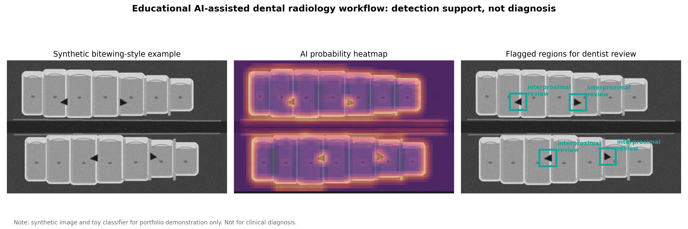

# Artificial Intelligence in Dental Radiology

This repository is a dentistry-oriented evidence review on artificial intelligence applications in dental and oral-maxillofacial radiology.

The review focuses on AI-assisted detection and interpretation in:

- dental caries
- periodontal bone loss
- periapical lesions
- CBCT and oral-maxillofacial imaging

## Project Purpose

The purpose of this project is to build a small, well-documented evidence review that can support research assistant and future dental specialization applications. It demonstrates literature searching, evidence mapping, critical appraisal, synthesis, and research communication.

## Review Question

How is artificial intelligence being applied in dental radiology for caries detection, periodontal bone loss detection, periapical lesion assessment, and CBCT/oral-maxillofacial imaging, and what are the major clinical limitations and research gaps?

## Why This Topic Matters

Dental radiographs are central to diagnosis and treatment planning, but interpretation can be affected by image quality, clinician experience, workload, and diagnostic complexity. AI models, especially deep learning and convolutional neural networks, are increasingly studied as tools to support detection, segmentation, classification, and clinical decision support.

This project treats AI as a support tool, not a replacement for clinician judgment.

## Current Scope

This is an evidence review in progress. The first version maps recent systematic reviews and narrative reviews across major dental radiology applications.

## Repository Structure

```text
ai-dental-radiology-review/
  README.md
  data/
    evidence_table.csv
  docs/
    review_protocol.md
    search_strategy.md
    draft_review.md
  figures/
  src/
```

## Initial Outputs

- Evidence table of key papers
- Draft review protocol
- Search strategy
- Narrative mini-review draft
- Practical AI-assisted radiology demo using a synthetic bitewing-style example

## Skills Demonstrated

- Dentistry-focused literature review
- Evidence table creation
- AI and dental radiology topic mapping
- Critical appraisal of clinical relevance and limitations
- GitHub documentation for a research portfolio
- Practical machine-learning workflow for radiograph-like image analysis

## Practical Implementation Demo

This repository includes an educational implementation of an AI-assisted dental radiology workflow:

```bash
python src/ai_radiology_demo.py
```

The demo trains a small machine-learning classifier on synthetic radiographic patches, scans a synthetic bitewing-style image, creates a probability heatmap, and flags suspicious interproximal radiolucent regions for clinician review.

The synthetic example is designed around posterior bitewing interpretation: suspected class II-style caries are placed between teeth near proximal contact areas, not in the middle of the tooth.

Main output:

```text
figures/ai_radiology_demo_workflow.png
```



Important: this is a portfolio and education demo only. It does not use real patient data and must not be used for diagnosis.

More detail: `docs/practical_demo.md`

## Planned Next Steps

1. Expand the evidence table with 15-25 papers.
2. Separate studies by imaging type: bitewing, periapical, panoramic, CBCT.
3. Add a PRISMA-style screening log.
4. Create a visual evidence map.
5. Convert the draft into a polished mini-review PDF.
